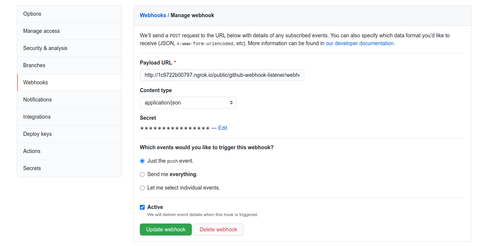
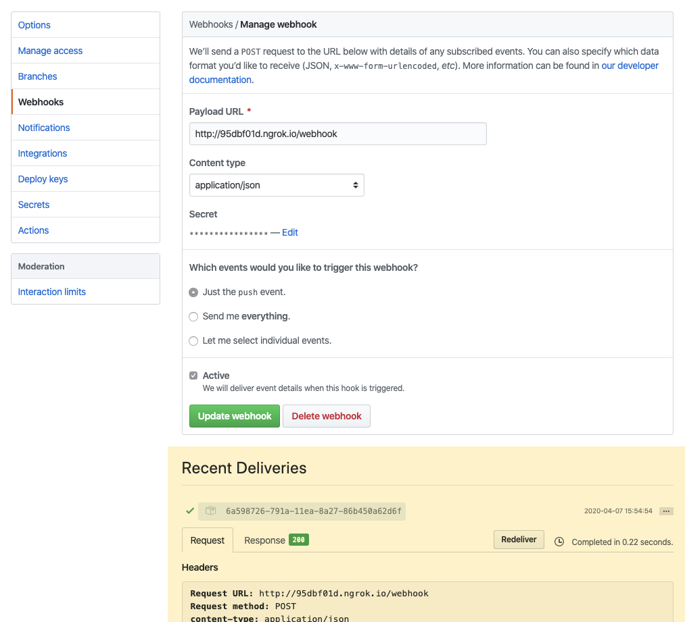

# gGitHub

GitHub has two different connectors needed: 

1. Webhook listener
2. Pickup taxi

They both require the same information of organization and repo. Allowing it to connect to GitHub. 

The webhook listener requires the secret field setup in GitHub for the repo to connect.   
The taxi accepts an oAuth key to allow access to the data. 

## **G**itHub Webhooks

To connect and get data from GitHub you will need to set up a webhook from GitHub. 

In your GitHub repository:  
Settings → Webhooks → Add webhook   
  
The structure of the webhook is as follows.

* Payload URL:

  * You need the job-id in order to set up the GitHub Webhook Payload URL

  **`http://<impulse-server>/public/github-webhook-listener/webhook/<impulse-job-id>`**


Note: If running locally you will need to set up ngrok.


* Content type: **`application/json`** 
* Secret**:** ``**`<same secret used above in call to github-webhook-listener>`** 

## Example

The configuration should look as the image below where we must use in the Payload URL our tunnel HTTP URL \(for this example `http://1c9722b00797.ngrok.io/public/github-webhook-listener/webhook/765143d8-7cb7-44b9-bbb8-b538b2d21056`\) and for the Secret we need to use the one we save in our configuration for the endpoint  


## **Activating sync**

To start a sync from GitHub, you will need to make a commit. You can add a new folder, change a text file, etc. That commit will fire the webhook and start the job. Pushing content into the repository will trigger a PUSH event sending the pushed element through Impulse to diesel and the destinations.

You can view if the initial start of the job was successful by viewing the webhook page:

\*\*\*\*



