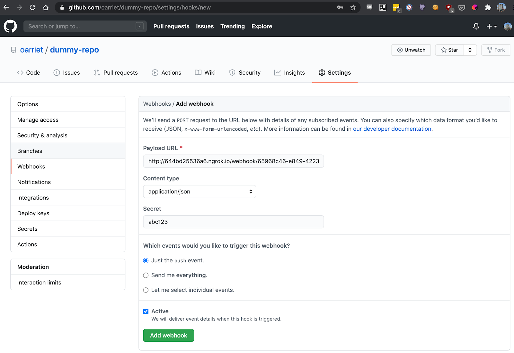

# GitHub Config

The last thing to setup is GitHub. You will need to setup the webhook option for the GitHub repo.

 **Set up Webhook in your Github repo.**  
 My current repo is: [https://github.com/oarriet/dummy-repo](https://github.com/oarriet/dummy-repo)  
[`https://github.com/oarriet/dummy-repo/settings/hooks/230811289`](https://github.com/oarriet/dummy-repo/settings/hooks/230811289)

* **Payload URL:**
  * You need the job-id in order to set up the GitHub Webhook Payload URL **`http://<impulse-server>/public/github-webhook-listener/webhook/<impulse-job-id>`**


Note: If running locally you will need to setup ngrok.


* **Content type:**  `application/json`
* **Secret:** `<same secret used above in call to github-webhook-listener>`

