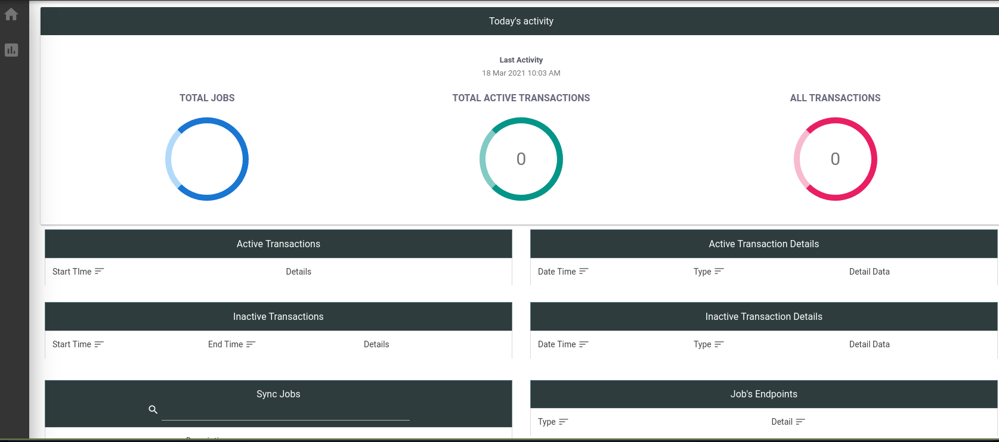
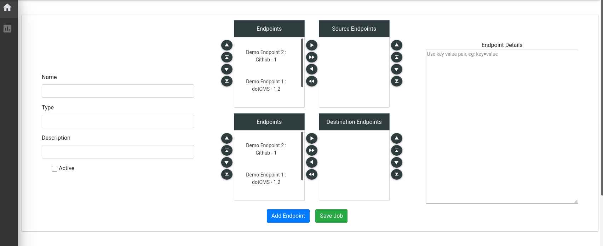
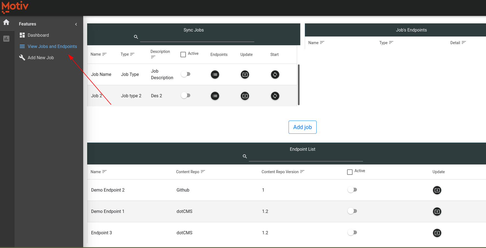
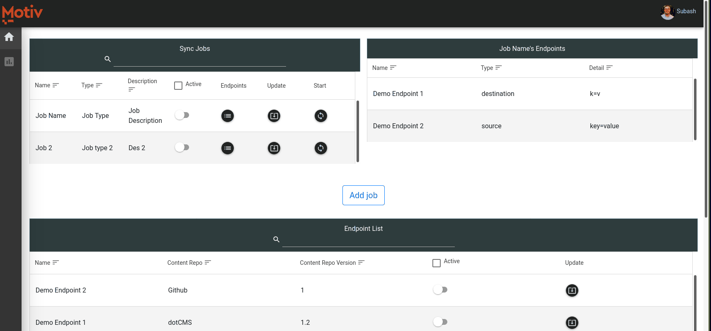

# ➕ Add Job

You can view the jobs and endpoints information by clickine home icon on left and selecting view jobs and endpoints.

Lets can update job,  look at endpoint details, and even start job from this screen.

