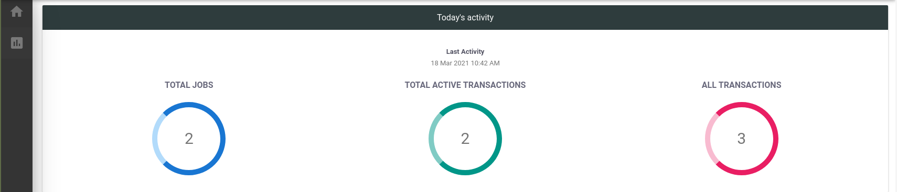
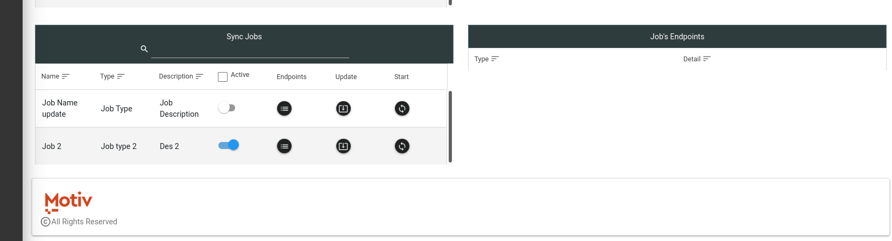

# Dashboard

Dashboard will give you overview of what impulse is running.

1. Total Jobs: It will gives you all the gives admin has created.
2. Total Active Transactions: Current active transactions
3. All Transaction:  It combine both active and inactive transactions.

1. Active transaction table: List transaction from running jobs.
   1. Active transaction detail table: Gives in-depth view/info of transaction.
2. Inactive transaction table: List completed transactions.
   1. Inactive transaction detail table: Gives in-depth view/info of transaction.
3. Sync Jobs:
   1. List all the job created since start of impulse, currently you cannot delete job, but make it inactive using active toggle. Each row has:
      1. Job Name
      2. Job Type
      3. Toggle to set job active or inactive
      4. Detail Icon - gives you endpoints details
      5.  Update Icon-  Takes to job update page, where we can not only update job info but add new endpoints and other details needed.
      6. Start - Start sync job

