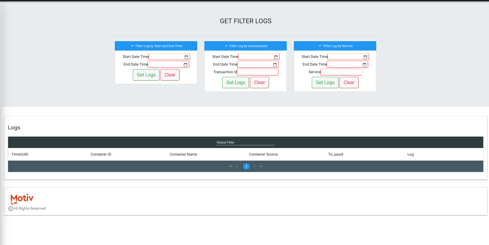

# Logger

#### GET FILTER LOGS

There are multiple ways to filter log data:

1. Filter logs by time range
2. Filter logs by time range and transaction id
3. Filter logs by time range and service name

